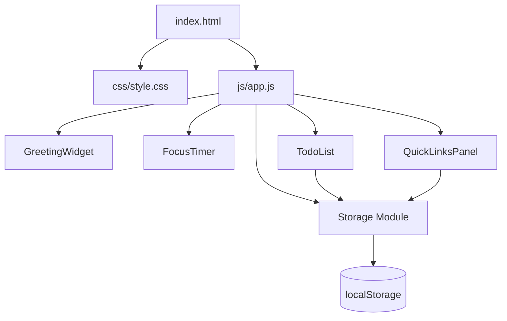

# Design Document: To-Do Life Dashboard

## Overview

The To-Do Life Dashboard is a single-page, client-side web application delivered as three static files: `index.html`, `css/style.css`, and `js/app.js`. It requires no server, no build step, and no external dependencies. Opening `index.html` in any modern browser is sufficient to run the application.

The dashboard presents four widgets in a single viewport:

1. **Greeting Widget** — live clock, date, and time-of-day greeting
2. **Focus Timer** — 25-minute Pomodoro countdown with Start / Stop / Reset
3. **To-Do List** — add, edit, complete, and delete tasks; persisted to `localStorage`
4. **Quick Links Panel** — add and delete URL shortcuts rendered as clickable buttons; persisted to `localStorage`

All state that must survive a page refresh is serialised as JSON and stored in `localStorage`. The application operates entirely in-memory during a session and flushes to `localStorage` on every mutation.

---

## Architecture

The application follows a simple **module-per-widget** pattern inside a single JavaScript file. There is no framework, no virtual DOM, and no module bundler. Each widget is an immediately-invoked or explicitly-initialised object literal that owns its own DOM references, state, and event listeners.

```
index.html
  └── <script src="js/app.js">
        ├── Storage module       — thin wrapper around localStorage
        ├── GreetingWidget       — clock/date/greeting
        ├── FocusTimer           — countdown logic
        ├── TodoList             — task CRUD
        └── QuickLinksPanel      — link CRUD
```

Initialisation order in `app.js`:

```
DOMContentLoaded
  ├── Storage.init()
  ├── GreetingWidget.init()
  ├── FocusTimer.init()
  ├── TodoList.init()
  └── QuickLinksPanel.init()
```

Each `init()` call:
1. Grabs its DOM container by a stable `id`.
2. Loads persisted state from `localStorage` via the Storage module.
3. Renders the initial UI.
4. Attaches event listeners.

There is no global event bus. Widgets are independent and do not communicate with each other.

### Mermaid — High-Level Component Diagram



---

## Components and Interfaces

### Storage Module

A thin wrapper that isolates all `localStorage` access. Every read and write is wrapped in a `try/catch`. If `localStorage` is unavailable, the module sets an internal `available` flag to `false` and emits a one-time non-blocking warning banner in the UI.

```
Storage.get(key)          → parsed object | null
Storage.set(key, value)   → void
Storage.isAvailable()     → boolean
```

Constants for storage keys:

```
STORAGE_KEY_TASKS  = 'tld_tasks'
STORAGE_KEY_LINKS  = 'tld_links'
```

### GreetingWidget

Owns the `#greeting-widget` container.

**Responsibilities:**
- Render the current time in `HH:MM` format.
- Render the current date as `"Weekday, Month Day"` (e.g. `"Monday, July 7"`).
- Derive and render the time-of-day greeting from the hour.
- Schedule a `setInterval` that fires every 60 seconds to refresh the display.

**Public interface:**

```
GreetingWidget.init()   → void
```

**Greeting logic:**

| Hour range | Greeting        |
|------------|-----------------|
| 05–11      | Good Morning    |
| 12–17      | Good Afternoon  |
| 18–20      | Good Evening    |
| 21–04      | Good Night      |

### FocusTimer

Owns the `#focus-timer` container.

**Responsibilities:**
- Maintain `remainingSeconds` (initialised to 1500).
- Maintain `intervalId` (null when stopped).
- Render `MM:SS` display.
- Handle Start, Stop, Reset button clicks.
- Auto-stop and notify when `remainingSeconds` reaches 0.

**Public interface:**

```
FocusTimer.init()   → void
```

**Internal state:**

```
remainingSeconds : number   // 0–1500
intervalId       : number | null
```

**Notification on completion:** The timer plays a short beep using the Web Audio API (`AudioContext`) and adds a CSS class `timer--complete` to the display element for a visual flash. Both are non-blocking and degrade gracefully if `AudioContext` is unavailable.

### TodoList

Owns the `#todo-list` container.

**Responsibilities:**
- Maintain an in-memory array of Task objects.
- Render the task list as `<li>` elements.
- Handle add, inline-edit, toggle-complete, and delete operations.
- Persist to `localStorage` after every mutation.
- Load from `localStorage` on `init()`.

**Public interface:**

```
TodoList.init()   → void
```

**Internal state:**

```
tasks : Task[]
```

**DOM structure per task (rendered):**

```
<li data-id="{id}">
  <input type="checkbox" />          ← toggle complete
  <span class="task-text" />         ← display mode
  <input class="task-edit" />        ← edit mode (hidden by default)
  <button class="btn-edit" />
  <button class="btn-delete" />
</li>
```

Edit mode is toggled by swapping CSS classes `task--display` / `task--editing` on the `<li>`.

### QuickLinksPanel

Owns the `#quick-links` container.

**Responsibilities:**
- Maintain an in-memory array of QuickLink objects.
- Render links as `<a>` or `<button>` elements that open in a new tab.
- Handle add and delete operations.
- Validate label (non-empty) and URL (`http://` or `https://` prefix).
- Persist to `localStorage` after every mutation.
- Load from `localStorage` on `init()`.

**Public interface:**

```
QuickLinksPanel.init()   → void
```

**Internal state:**

```
links : QuickLink[]
```

---

## Data Models

### Task

```js
{
  id          : string,   // crypto.randomUUID() or Date.now().toString()
  description : string,   // non-empty, trimmed
  completed   : boolean   // default: false
}
```

Stored under `localStorage` key `tld_tasks` as a JSON array.

### QuickLink

```js
{
  id    : string,   // crypto.randomUUID() or Date.now().toString()
  label : string,   // non-empty, trimmed
  url   : string    // must start with "http://" or "https://"
}
```

Stored under `localStorage` key `tld_links` as a JSON array.

### localStorage Schema

```
tld_tasks  →  JSON.stringify(Task[])
tld_links  →  JSON.stringify(QuickLink[])
```

---

## Correctness Properties

> **Note:** Property-based testing is not applicable to this feature. The application is a pure UI with no build tooling, no test runner, and no testing framework. All logic (greeting derivation, timer countdown, validation, serialisation) is tightly coupled to the DOM and `localStorage` browser APIs. The constraint of a single vanilla JS file with no external dependencies makes automated property testing impractical. Correctness is instead verified through the manual testing strategy described below.

---

## Error Handling

### localStorage Unavailable

`Storage.get` and `Storage.set` are each wrapped in `try/catch`. On the first caught error, the Storage module:

1. Sets `available = false`.
2. Inserts a `<div id="storage-warning">` banner at the top of the page with the message: *"Local storage is unavailable. Your data will not be saved between sessions."*
3. Subsequent calls to `Storage.set` are no-ops; `Storage.get` returns `null`.

Widgets continue to operate normally using in-memory state.

### Corrupted localStorage Data

`Storage.get` calls `JSON.parse` inside the `try/catch`. If parsing fails (corrupted data), it returns `null`. Both `TodoList` and `QuickLinksPanel` treat a `null` return as an empty array and start fresh.

### Empty / Invalid Input

- **TodoList add:** If the trimmed input value is empty, the add operation is aborted and an inline `<span class="validation-msg">` is shown beneath the input field. The message is cleared on the next valid submission or when the input changes.
- **TodoList edit confirm:** If the trimmed edit value is empty, the update is rejected, the previous description is restored, and edit mode is exited.
- **QuickLinksPanel add:** Validation checks both label (non-empty) and URL (non-empty + `http://` or `https://` prefix). Failures show an inline `<span class="validation-msg">` with a specific message per field.

### Timer Edge Cases

- Calling Start when the timer is already running is a no-op (the Start button is disabled while counting down).
- Calling Reset while counting down clears the interval before restoring state.
- If `AudioContext` is not supported, the beep is silently skipped; only the visual notification fires.

---

## Testing Strategy

> **No automated tests.** Per the project constraint, there are no test files, no test setup, and no testing framework. All verification is manual.

### Manual Verification Checklist

**Greeting Widget**
- Open the page at different times of day and confirm the correct greeting, time, and date are shown.
- Advance the system clock past a boundary (e.g. 11:59 → 12:00) and confirm the greeting updates within one minute.

**Focus Timer**
- Click Start; confirm the display counts down in one-second intervals.
- Click Stop; confirm the countdown pauses and the remaining time is retained.
- Click Start again; confirm the countdown resumes from the paused value.
- Click Reset; confirm the display returns to 25:00 and the countdown stops.
- Let the timer run to 00:00; confirm it stops automatically and a notification appears.

**To-Do List**
- Add a task with a valid description; confirm it appears in the list.
- Attempt to add an empty task; confirm the validation message appears and no task is added.
- Edit a task; confirm the description updates.
- Attempt to save an empty edit; confirm the previous description is restored.
- Toggle a task complete; confirm the visual style changes.
- Delete a task; confirm it is removed.
- Refresh the page; confirm all tasks are restored from `localStorage`.

**Quick Links Panel**
- Add a link with a valid label and `https://` URL; confirm it renders as a clickable button.
- Click the button; confirm it opens in a new tab.
- Attempt to add a link with an empty label; confirm the validation message appears.
- Attempt to add a link with a URL missing the `http(s)://` prefix; confirm the validation message appears.
- Delete a link; confirm it is removed.
- Refresh the page; confirm all links are restored from `localStorage`.

**Data Persistence**
- Add tasks and links, then close and reopen the browser; confirm data persists.
- Manually corrupt the `tld_tasks` value in DevTools; confirm the app loads with an empty list and no crash.

**Responsive Layout**
- Resize the browser from 320px to 1920px; confirm no horizontal scrollbar appears and all components remain usable.

**Browser Compatibility**
- Run the manual checklist in Chrome, Firefox, Edge, and Safari.
